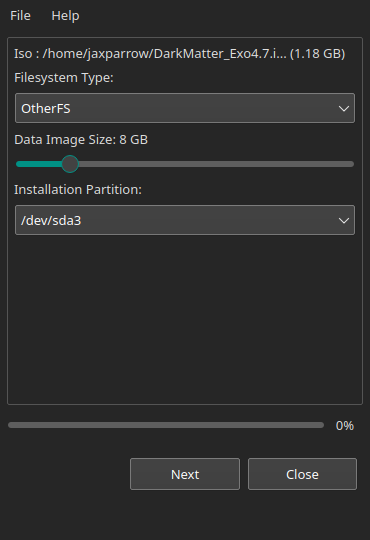
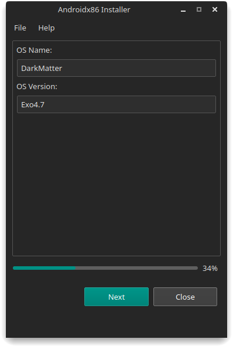

# Androidx86-Installer-Linux
```
Advanced and easy to use Advanced Android x86 installer for Linux.
Developed with Python for linux.
```
### Screens (GUI)
**Starting - Iso Selection and configuration**<br>

<br>
**OS Information - OS Name and Version**<br>

<br>
*Note : If you are a Android x86 dev or modder and if you create iso for AXON's Advanced x86 Installer. This Installer also supports the config you create*
https://github.com/AXIM0S/advanced-android-x86-win-installer-dev
<br>
#### Other Notes
This is still in beta has a lot of bugs and dirty code. I will fix them before publishing
